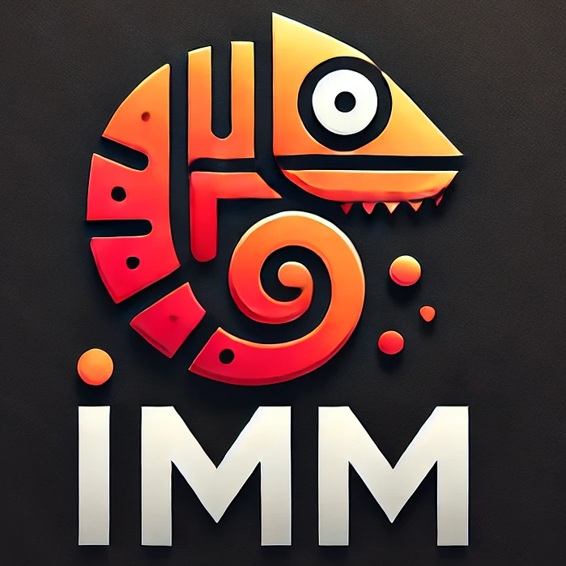
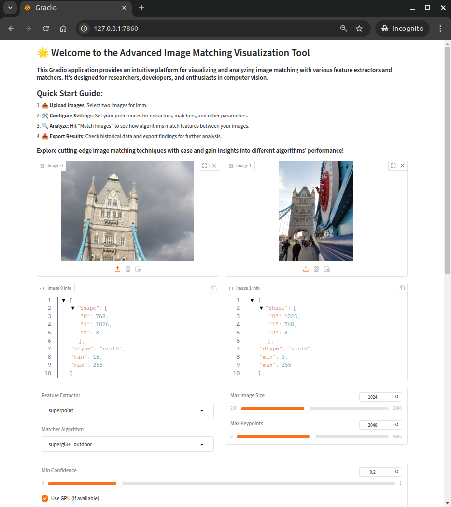
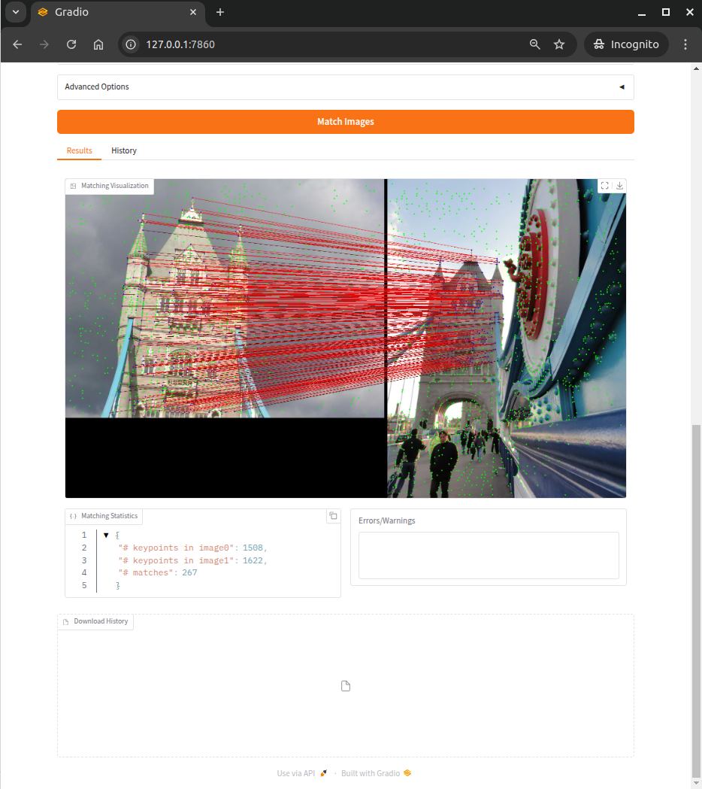
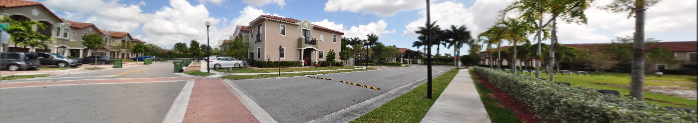

<p align="left" style="display: flex; align-items: center;">
    
    <span style="font-size: 2em; font-weight: bold;">IMM for  Image Matching </span>
</p>

#

**ImMatch (IMM)** is a versatile library for image matching and feature extraction in computer vision applications. It provides algorithms to detect, describe, and match keypoints between images, as well as estimate geometric relationships, making it ideal for tasks such as visual localization, augmented reality, and 3D reconstruction.

## Table of Contents 📑

- [Prerequisites](#prerequisites)
- [Installation 🖥️](#installation-️)
- [Running with Docker 🐳](#running-with-docker-)
- [Supported Algorithms](#supported-algorithms)
  - [Extractors](#supported-extractors)
  - [Matchers](#supported-matchers)
  - [Estimators](#supported-estimators)
- [Usage](#usage)
  - [Feature Extraction](#feature-extraction)
  - [Feature Matching](#feature-matching)
  - [Geometric Estimation](#geometric-estimation)

## Prerequisites

Before installing ImMatch, ensure you have the following:

- Python 3.8 or later
- Conda
- CUDA Toolkit

## Installation 🖥️

1. Clone the Repository

```bash
git clone https://github.com/Tarekbouamer/imm.git
cd imm
```

1. Set Up a Conda Environment

```bash
conda create -n imm python=3.8 -y
conda activate imm
```

1. Install Dependencies

```bash
python -m pip install --upgrade pip
pip install torch==2.4.0 torchvision==0.19.0 torchaudio==2.4.0 --index-url https://download.pytorch.org/whl/cu118
```

1. Install ImMatch

```bash
pip install .[optional]
```

## Running with Docker 🐳

For those who prefer using Docker, we provide a Dockerfile to set up ImMatch in a containerized environment.

1. Build the Docker image:

```bash
docker build -t imm:latest .
```

1. Run the Docker container:

```bash
docker run -it --gpus all imm:latest
```

## Troubleshooting

### `imm-gui`: matplotlib `undefined symbol: FT_Load_Glyph`

This usually means matplotlib was built against a different FreeType than the one loaded at runtime. In a conda environment, reinstall FreeType and matplotlib from the same channel:

```bash
conda activate forge   # or your env name
conda install -c conda-forge freetype matplotlib --force-reinstall
```

Then run `imm-gui` again.

## Supported Algorithms

ImMatch supports a wide range of feature extractors, matchers, and geometric estimators. Here's an overview:

### Supported Extractors

| Extractor      |
|----------------|
| Caps           |
| D2-Net         |
| DISK           |
| R2D2           |
| Superpoint     |
| XFeat          |

### Supported Matchers

| Matcher      |
|--------------|
| Aspanformer  |
| DKM          |
| Lightglue    |
| Lighterglue  |
| LoFTR        |
| NN           |  
| Superglue    |

(For more visualization on the supported algorithms, check out the [Gallery](Gallery.md).)

### Supported Estimators

| Estimator          | PoseLib          | PyColmap         | OpenCV           |
|--------------------|:----------------:|:----------------:|:----------------:|
| Fundamental Matrix |                  |                  |                  |
| Essential Matrix   |                  |                  |                  |
| Homography         |:white_check_mark:|:white_check_mark:|:white_check_mark:|
| PnP                |:white_check_mark:|:white_check_mark:|:white_check_mark:|
| Relative Pose      |:white_check_mark:|:white_check_mark:|:white_check_mark:|

## Usage

ImMatch provides command-line tools for feature extraction, matching, and geometric estimation. Here are the main commands:

### Feature Extraction

Use the `imm-extract` script to extract features from an image or a folder of images:

```bash
# image
imm-extract --model extractor --img_path /path/to/your/image.jpg --max_keypoints 1600

# dataset
imm-extract --model extractor --img_path /path/to/your/dataset --output_dir /path/to/save/features --max_keypoints 1600

  Options:
    --model             Extractor name
    --img_path          Path to the image or dataset
    --output_dir        Path to save extracted features
    --max_keypoints     Maximum number of keypoints
    --batch_size        Batch size for dataset extraction
    --num_workers       Number of workers for DataLoader

# example
imm-extract --model superpoint --img_path assets/graffiti.png --max_keypoints 1600
```

### Feature Matching

Use the `imm-match` script to match features between two images, extract features if needed :

```bash
imm-match IMG0_PATH IMG1_PATH [OPTIONS]

  Options:
    --matcher         Matcher name
    --extractor       Extractor name
    --max_img_size        Max image size
    --output_dir      Output directory for logs and visualization
    --threshold       Matching score threshold
    --visualize       Enable or disable visualization

# example
imm-match assets/graffiti.png assets/graffiti.png --matcher superglue_outdoor --extractor superpoint --max_img_size 1000 --output_dir results --threshold 0.2 --visualize

```

### Robust Estimation

Use the `imm-estimate` script to estimate geometric relationships between two images:

```bash
imm-estimate [OPTIONS] COMMAND [ARGS]

  Commands:
    homography     Estimate the homography transformation between two images.
    relative-pose  Estimate the relative pose between two images.

  Options:
    --matcher         Matcher name
    --extractor       Extractor name
    --backend         Estimator backend "cv|poselib|pycolmap"
    --solver          Homography solver "ransac|lmeds|rho|usac|usac_parallel|usac_accurate|usac_fast|usac_prosac|usac_magsac"              
    --thd             Reprojection error threshold
    --max_iters       Max iterations
    --confidence      Confidence level
    --max_img_size        Max image size
    --output_dir      Output directory for logs and visualization

# example
imm-estimate homography assets/graffiti.png assets/graffiti.png --matcher superglue_outdoor --extractor superpoint --max_img_size 1000 --output_dir results --threshold 0.2 
```

### Gradio Interface 🌐 (:construction:)

ImMatch also provides a Gradio interface for all the supported matching algorithms. To run the GUI, use the following command:

```bash
imm-gui 

# default: Running on local URL:  http://127.0.0.1:7860
```

<p align="center">
    
    
</p>

Full guideline is available on the gradio interface web page.

### Demo 🎥

Some usefull examples and demos are available `demo` folder.

```bash
# PnP chessboard demo
python demo/pnp_chessboard.py [INPUT_PATH] [CALIBRATION_FILE]

Options:
  --backend Backend to use.
            [opencv|poselib|pycolmap]
```

```bash
# Panorama stitching demo
python demo/stitcher.py [OPTIONS]

Options:
  --input TEXT      Path to input directory 
  --output TEXT     Path to output directory
  --extractor       Feature extractor to use.
  --matcher         Feature matcher to use.
  --backend         Homography backend.
                    [opencv|pycolmap|poselib]
                                  
  --resize          Maximum image size.
  --max_keypoints   Maximum number of keypoints to detect.
  --visualize       Visualize the stitched image.
```

<p align="center">
    
</p>
